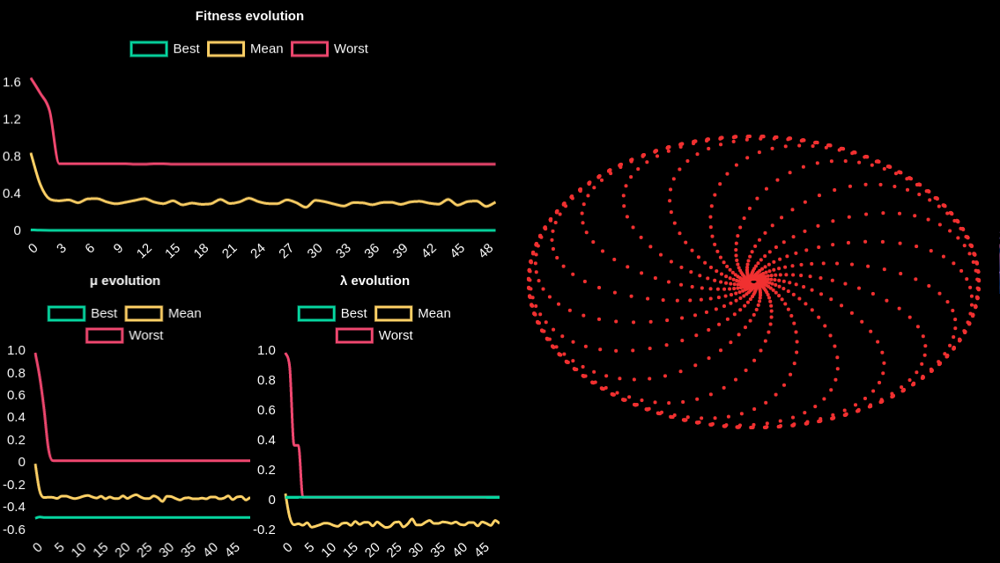
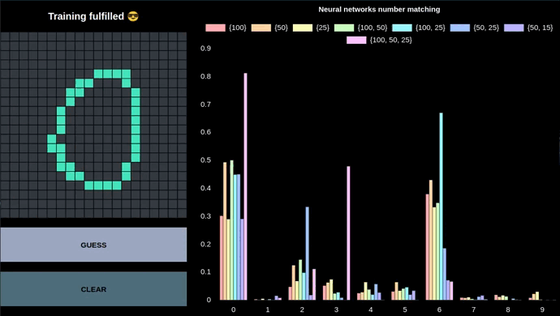
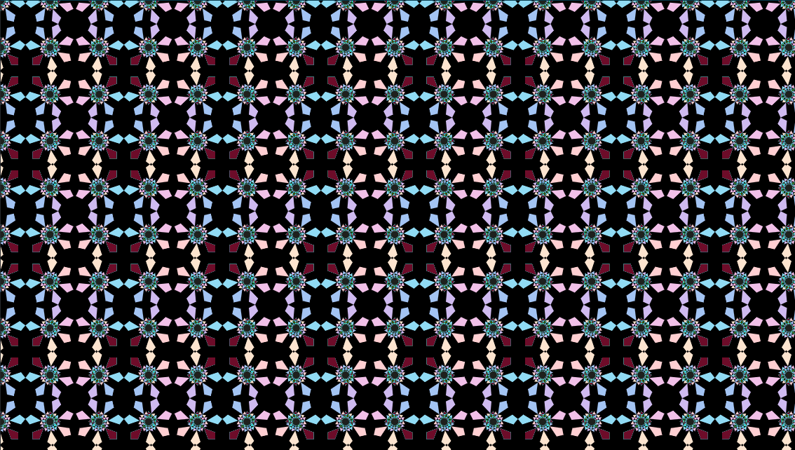
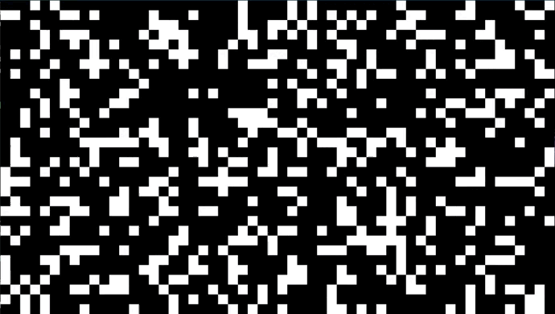

<!-- PROJECT SHIELDS -->

<!-- PROJECT LOGO -->

 

    
    <h3 align="center">Artificial Intelligence in Computer Graphics</h3>
    

        Class projects
         
        <a href="https://luunynliny.github.io/AIiCG/">View</a>
    

<!-- ABOUT THE PROJECT -->

## About

In 2021, I had the opportunity to do an exchange semester at the University of Silesia in Katowice at the [Faculty of Science and Technology](https://us.edu.pl/wydzial/wnst/en/).

Among the proposed subjects, I decided to attend the *Artificial Intelligence in Computer Graphics* course, given by [Dr Miłosław Chodacki](https://www.researchgate.net/profile/Miloslaw-Chodacki).
This class introduced me to AI and algorithmics in the generation of aesthetic patterns.

This repository gathers all my laboratory assignments into an interactive website.

<a href="#top"><i>back to top</i></a>

### Built With

* [p5.js](https://p5js.org/)
* [Chart.js](https://www.chartjs.org/)
* [Brain.js](https://brain.js.org/)
* [Chance.js](https://chancejs.com/)
* [chroma.js](https://gka.github.io/chroma.js/)

<a href="#top"><i>back to top</i></a>

<!-- USAGE EXAMPLES -->

## Usage

### Gumowski-Mira System

Gumowski-Mira attractor is an equation system, used by two CERN physicists in 1980, allowing to generate aesthetic following more or less a circle shape.

I was asked to implement a simpler variant of this system, that I improved by adding interactivity:

- Two sliders modifying equation parameters
- One slider to choose the number of iterations
- Draggable origin point
- In and out mouse scroll zoom

    

<a href="#top"><i>back to top</i></a>

### Genetic Algorithm

A genetic algorithm is a search heuristic that is inspired by Charles Darwin’s theory of evolution. It puts in competition several individuals where the fittest are selected to produce offspring for the next generation.

I was asked to implement, and plot the progression, of a genetic search for a specific Gumowski-Mira configuration.

    

*Gumowski-Mira system is very sensible and a slight parameter modification can change the look of the generated figure. Because of that, my genetic approach may sometimes find a not-close-enough solution and display a different shape from the targeted one.*

<a href="#top"><i>back to top</i></a>

### Optical Character Recognition

Optical Character Recognition is the process of detecting and recognizing printed or handwritten text characters.

I was asked to build a system to train several neural networks with handwritten numbers and to be able to test them afterwards.

To play with it, it requires first to submit five handwritten (more mouse written) samples for each number. 

    

*The train of the neural networks may take more or less time depending on your computer. If your browser doesn't respond, try to wait.*

*With so few samples, the neural networks are obviously not perfect (as shown above with the number four).*

<a href="#top"><i>back to top</i></a>

### Rosette Tiling

Rosettes are figures obtained through successive rotations of a shape.

I was asked the generate a colourful aesthetic rosette tiling.

    

<a href="#top"><i>back to top</i></a>

### Game of Life

The Game of Life is a cellular automaton invented in 1970 by the mathematician John Conway.Using only three elementary rules, it is possible to simulate simple 'living' organisms.

The version I choose to implement is different from the 'classic' because the 'world' border of the simulation are linked.

You can add/remove a cell by clicking on it, and use key actions to allow more interactions:

- <kbd>p</kbd> ⇨ play/pause
- <kbd>+</kbd> ⇨ increase speed 
- <kbd>-</kbd> ⇨ decrease speed
- <kbd>d</kbd> ⇨ clear cells 
- <kbd>r</kbd> ⇨ generate a random cells configuration (0.3 probability)
- <kbd>s</kbd> ⇨ save a picture of the simulation (if paused)

    

I also provided two other 'mode' to the Game of Life:

- <kbd>c</kbd> ⇨ color mode (cells leave marks of their presence)
- <kbd>h</kbd> ⇨ heatmap mode (cells repartition over time)
- <kbd>b</kbd> ⇨ 'classic'

    

<a href="#top"><i>back to top</i></a>

<!-- LICENSE -->

## License

Distributed under the MIT License. See `LICENSE.txt` for more information.

<a href="#top"><i>back to top</i></a>

